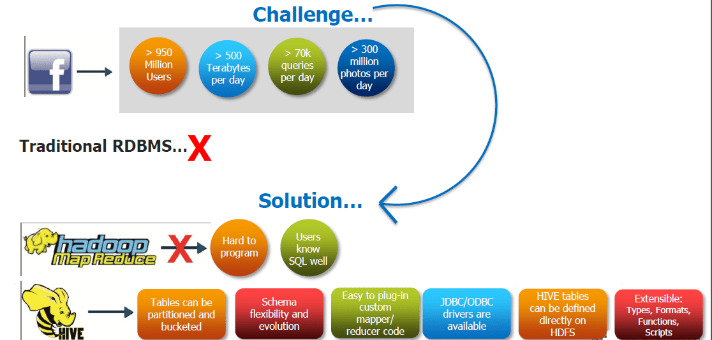

# What is HIVE?
<p>Apache Hive is a Data Warehousing package built on top of Hadoop and is used for data analysis.
It is used for managing and querying structured data.
Hive allows traditional map/reduce programmers to plug in their custom mappers and reducers.
The popular feature of Hive is that there is no need to learn Java.
 </p>

 ## Why we need Hive?



## Let's start working with Hive
<p>Hive Allows programmers to plug in custom Mappers and Reducers.Hive Has Data Warehouse infrastructure. Provides tools to enable easy data ETL. Defines SQL-like query language called HQL. The Hive Query Language (HiveQL) is a query language for Hive to process and analyze structured data in a Metastore. Hive is mainly used because of it's one of the best feature and that is faster Batch Processing.
</p>

## HQL

### Database creation in Hive
``` HQL
CREATE SCHEMA IF NOT EXISTS population;
```
<p> Now we will create a table under this database <b>"Population"</b>. </p>

### Table creation in Hive
```
CREATE TABLE IF NOT EXISTS population.abortion(Period int,Age_of_woman String,
Induced_abortions int)
ROW FORMAT DELIMITED
FIELDS TERMINATED BY ',' 
STORED AS TEXTFILE;
```
<p>This table is basically created to load values from a <b>.csv</b> file. Hence, Fields are terminated by ','. </p>

### Load values from a .csv File into the table
```
LOAD DATA LOCAL INPATH '/home/cloudera/Desktop/abortion.csv' INTO TABLE population.abortion;
```
> To know more about hive & the HQL queries please the <b>Big Data Tool-Hive.pptx</b> file and <b>HQL.txt</b>.</p>

# Thank You